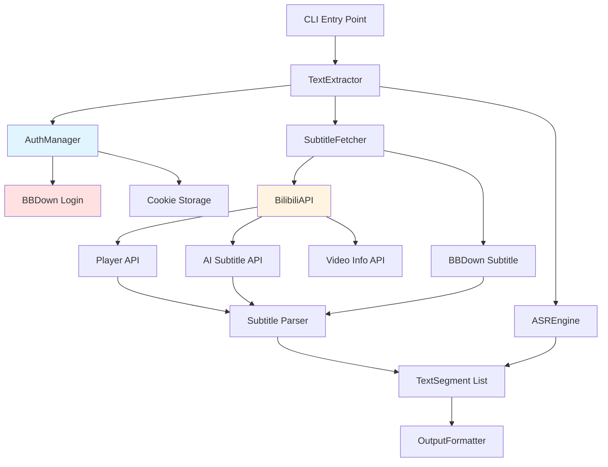
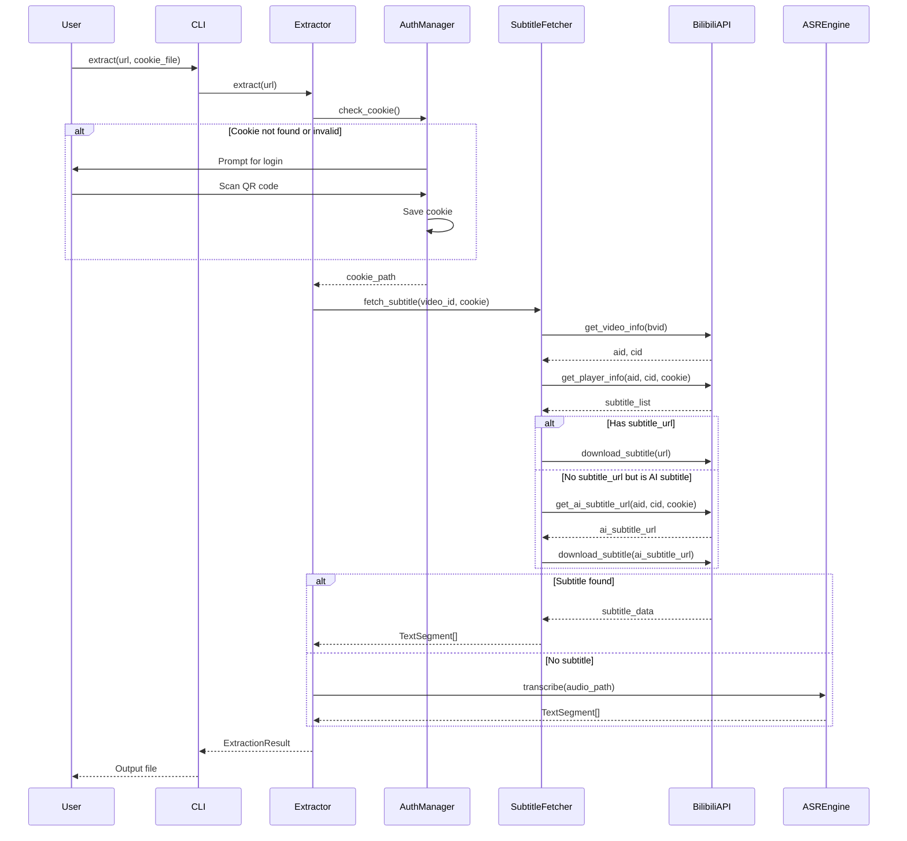

# Design Document: B站AI字幕支持和Cookie管理

## Overview

为B站视频文字提取系统添加AI字幕支持和自动Cookie管理功能。当前系统使用BBDown获取字幕，但BBDown无法获取B站的AI字幕。通过分析SubBatch浏览器插件，发现B站提供了专门的AI字幕API。此外，某些视频（大会员内容、付费内容）需要Cookie才能访问字幕。本设计将实现：(1) 调用B站播放器API获取AI字幕，(2) 集成BBDown登录功能管理Cookie，(3) 建立字幕获取优先级机制（播放器API → ASR）。

## Architecture



## Main Algorithm/Workflow




## Components and Interfaces

### Component 1: AuthManager

**Purpose**: 管理B站登录Cookie，检查Cookie有效性，调用BBDown登录功能

**Interface**:
```python
class AuthManager:
    def __init__(self, config: Config):
        """初始化认证管理器"""
        
    def check_cookie(self) -> bool:
        """检查Cookie是否存在且有效"""
        
    def get_cookie_path(self) -> Optional[Path]:
        """获取Cookie文件路径"""
        
    def login_with_bbdown(self) -> Path:
        """使用BBDown登录并返回Cookie文件路径"""
        
    def read_cookie_content(self, cookie_path: Path) -> str:
        """读取Cookie文件内容为字符串"""
        
    def validate_cookie_format(self, cookie_path: Path) -> bool:
        """验证Cookie文件格式是否正确"""
```

**Responsibilities**:
- 检测BBDown保存的Cookie文件位置（BBDown.exe同目录/BBDown.data）
- 验证Cookie文件是否存在和有效
- 调用BBDown登录命令（显示二维码）
- 读取Cookie内容供API调用使用（格式：SESSDATA=xxx;bili_jct=xxx）
- 处理Cookie相关错误
- 支持Web登录（BBDown.data）和TV登录（BBDownTV.data）

### Component 2: BilibiliAPI

**Purpose**: 封装B站API调用，包括视频信息、播放器信息、AI字幕URL获取

**Interface**:
```python
class BilibiliAPI:
    def __init__(self, cookie: Optional[str] = None):
        """初始化API客户端"""
        
    def get_video_info(self, bvid: str) -> VideoInfo:
        """获取视频基本信息（aid, cid, title等）"""
        
    def get_player_info(self, aid: str, cid: str) -> Dict[str, Any]:
        """获取播放器信息（包含字幕列表）"""
        
    def get_ai_subtitle_url(self, aid: str, cid: str) -> str:
        """获取AI字幕的下载URL"""
        
    def download_subtitle(self, subtitle_url: str) -> Dict[str, Any]:
        """下载字幕内容（JSON格式）"""
        
    def format_subtitle_url(self, url: str) -> str:
        """格式化字幕URL（处理相对路径）"""
```

**Responsibilities**:
- 调用B站视频信息API
- 调用B站播放器API获取字幕列表
- 调用AI字幕专用API获取字幕URL
- 下载字幕JSON数据
- 处理API错误和重试逻辑
- 添加必要的HTTP头（Cookie, User-Agent等）


### Component 3: SubtitleParser

**Purpose**: 解析不同格式的字幕数据（AI字幕和普通字幕）

**Interface**:
```python
class SubtitleParser:
    @staticmethod
    def is_ai_subtitle_format(data: Dict[str, Any]) -> bool:
        """检测是否是AI字幕格式"""
        
    @staticmethod
    def parse_subtitle(data: Dict[str, Any]) -> List[TextSegment]:
        """解析字幕数据为TextSegment列表"""
        
    @staticmethod
    def parse_ai_subtitle(data: Dict[str, Any]) -> List[TextSegment]:
        """解析AI字幕格式"""
        
    @staticmethod
    def parse_regular_subtitle(data: Dict[str, Any]) -> List[TextSegment]:
        """解析普通字幕格式"""
```

**Responsibilities**:
- 检测字幕格式类型（AI vs 普通）
- 解析AI字幕JSON结构
- 解析普通字幕JSON结构
- 转换为统一的TextSegment格式
- 处理时间戳转换

### Component 4: Enhanced SubtitleFetcher

**Purpose**: 协调字幕获取流程，实现优先级降级机制

**Interface**:
```python
class SubtitleFetcher:
    def __init__(self, config: Config):
        """初始化字幕获取器"""
        
    def fetch_subtitle(self, video_id: str, cookie: Optional[str] = None) -> List[TextSegment]:
        """获取字幕（主入口）"""
        
    def fetch_from_bilibili_api(self, bvid: str, cookie: str) -> List[TextSegment]:
        """从B站API获取字幕（普通+AI）"""
        
    def fetch_with_bbdown(self, video_id: str, cookie: Optional[str] = None) -> List[Path]:
        """使用BBDown获取字幕（保留作为备用）"""
```

**Responsibilities**:
- 实现字幕获取优先级：播放器API → BBDown → ASR
- 协调BilibiliAPI和SubtitleParser
- 处理字幕获取失败的降级逻辑
- 缓存字幕数据
- 记录日志

## Data Models

### Model 1: SubtitleInfo

```python
@dataclass
class SubtitleInfo:
    lan: str                    # 语言标识（'zh-CN', 'ai-zh'等）
    lan_doc: str               # 语言描述
    subtitle_url: str          # 字幕URL（可能为空）
    ai_status: Optional[int]   # AI字幕状态（2表示AI字幕）
    
    def is_ai_subtitle(self) -> bool:
        """判断是否是AI字幕"""
        return self.lan.startswith('ai-')
    
    def needs_ai_api(self) -> bool:
        """判断是否需要调用AI字幕API"""
        return self.is_ai_subtitle() and not self.subtitle_url
```

**Validation Rules**:
- lan不能为空
- lan_doc不能为空
- 如果is_ai_subtitle()为True且subtitle_url为空，必须调用AI字幕API


### Model 2: PlayerResponse

```python
@dataclass
class PlayerResponse:
    code: int
    message: str
    data: Dict[str, Any]
    
    def get_subtitles(self) -> List[SubtitleInfo]:
        """提取字幕列表"""
        subtitles_data = self.data.get('subtitle', {}).get('subtitles', [])
        return [SubtitleInfo(**sub) for sub in subtitles_data]
    
    def find_ai_subtitle(self) -> Optional[SubtitleInfo]:
        """查找AI中文字幕"""
        subtitles = self.get_subtitles()
        return next((s for s in subtitles if s.lan == 'ai-zh'), None)
```

**Validation Rules**:
- code必须为0表示成功
- data必须包含subtitle字段
- subtitle.subtitles必须是列表

### Model 3: AISubtitleResponse

```python
@dataclass
class AISubtitleResponse:
    code: int
    message: str
    data: Dict[str, Any]
    
    def get_subtitle_url(self) -> Optional[str]:
        """获取AI字幕URL"""
        return self.data.get('subtitle_url')
```

**Validation Rules**:
- code必须为0表示成功
- data.subtitle_url不能为空

### Model 4: CookieInfo

```python
@dataclass
class CookieInfo:
    path: Path
    content: str
    is_valid: bool
    login_type: str  # 'web' or 'tv'
    
    @classmethod
    def from_bbdown(cls, login_type: str = 'web') -> Optional['CookieInfo']:
        """从BBDown默认位置读取Cookie
        
        Args:
            login_type: 'web' for BBDown.data, 'tv' for BBDownTV.data
        """
        import shutil
        
        bbdown_path = shutil.which("BBDown")
        if not bbdown_path:
            return None
        
        bbdown_dir = Path(bbdown_path).parent
        cookie_file = bbdown_dir / f"BBDown{'TV' if login_type == 'tv' else ''}.data"
        
        if not cookie_file.exists():
            return None
        
        content = cookie_file.read_text(encoding='utf-8')
        is_valid = cls._validate_content(content, login_type)
        
        return cls(
            path=cookie_file,
            content=content,
            is_valid=is_valid,
            login_type=login_type
        )
    
    @staticmethod
    def _validate_content(content: str, login_type: str) -> bool:
        """验证Cookie内容格式"""
        if login_type == 'web':
            # Web登录格式：SESSDATA=xxx;bili_jct=xxx
            return 'SESSDATA=' in content
        else:
            # TV登录格式：access_token=xxx
            return 'access_token=' in content
    
    def to_header_string(self) -> str:
        """转换为HTTP请求头格式"""
        if self.login_type == 'web':
            # 已经是正确格式：SESSDATA=xxx;bili_jct=xxx
            # 需要将%2C转回逗号
            return self.content.replace('%2C', ',')
        else:
            # TV登录使用access_token
            return self.content
```

**Validation Rules**:
- path必须存在
- content不能为空
- Web登录必须包含SESSDATA字段
- TV登录必须包含access_token字段
- Cookie中的%2C需要转义处理

## Algorithmic Pseudocode

### Main Processing Algorithm

```python
def extract_with_subtitle_priority(url: str, config: Config) -> ExtractionResult:
    """
    主提取算法：实现字幕获取优先级
    
    Preconditions:
    - url is valid Bilibili video URL
    - config is properly initialized
    
    Postconditions:
    - Returns ExtractionResult with text segments
    - All segments have valid timestamps
    - Source field indicates subtitle or ASR
    
    Loop Invariants: N/A
    """
    # Step 1: 验证URL并提取video_id
    video_id = validate_and_extract_video_id(url)
    assert video_id is not None, "Invalid video URL"
    
    # Step 2: 检查并获取Cookie
    auth_manager = AuthManager(config)
    cookie = None
    
    if not auth_manager.check_cookie():
        logger.info("Cookie not found, prompting for login")
        cookie_path = auth_manager.login_with_bbdown()
        cookie = auth_manager.read_cookie_content(cookie_path)
    else:
        cookie_path = auth_manager.get_cookie_path()
        cookie = auth_manager.read_cookie_content(cookie_path)
    
    assert cookie is not None, "Cookie must be available"
    
    # Step 3: 尝试从B站API获取字幕
    subtitle_fetcher = SubtitleFetcher(config)
    
    try:
        segments = subtitle_fetcher.fetch_from_bilibili_api(video_id, cookie)
        assert all(seg.start_time < seg.end_time for seg in segments)
        return ExtractionResult(segments=segments, source='bilibili_api')
    except SubtitleNotFoundError:
        logger.info("No subtitle found via API, trying ASR")
    
    # Step 4: 降级到ASR
    video_path = download_video(video_id)
    audio_path = extract_audio(video_path)
    
    asr_engine = create_asr_engine(config)
    segments = asr_engine.transcribe(audio_path)
    
    assert all(seg.start_time < seg.end_time for seg in segments)
    return ExtractionResult(segments=segments, source='asr')
```


### Subtitle Fetching Algorithm

```python
def fetch_from_bilibili_api(bvid: str, cookie: str) -> List[TextSegment]:
    """
    从B站API获取字幕（完整SubBatch逻辑）
    
    Preconditions:
    - bvid is valid Bilibili video ID
    - cookie contains valid SESSDATA
    
    Postconditions:
    - Returns non-empty list of TextSegments if subtitle found
    - Raises SubtitleNotFoundError if no subtitle available
    - All segments have valid timestamps (start < end)
    
    Loop Invariants:
    - For subtitle list iteration: all checked subtitles are valid SubtitleInfo
    """
    # Step 1: 获取视频信息
    bilibili_api = BilibiliAPI(cookie)
    video_info = bilibili_api.get_video_info(bvid)
    
    aid = video_info.aid
    cid = video_info.cid
    assert aid is not None and cid is not None
    
    # Step 2: 获取播放器信息（包含字幕列表）
    player_info = bilibili_api.get_player_info(aid, cid)
    player_response = PlayerResponse(**player_info)
    
    if player_response.code != 0:
        raise BilibiliAPIError(f"Player API error: {player_response.message}")
    
    # Step 3: 查找字幕（优先AI中文字幕）
    subtitles = player_response.get_subtitles()
    
    if not subtitles:
        raise SubtitleNotFoundError("No subtitles available")
    
    # 优先查找AI中文字幕
    target_subtitle = player_response.find_ai_subtitle()
    
    if not target_subtitle:
        # 降级到第一个可用字幕
        target_subtitle = subtitles[0]
    
    assert target_subtitle is not None
    
    # Step 4: 获取字幕URL
    subtitle_url = target_subtitle.subtitle_url
    
    if not subtitle_url:
        # 情况A: URL为空且是AI字幕 - 需要调用AI字幕API
        if target_subtitle.is_ai_subtitle():
            logger.info("AI subtitle detected, fetching URL from AI API")
            subtitle_url = bilibili_api.get_ai_subtitle_url(aid, cid)
            
            if not subtitle_url:
                raise SubtitleNotFoundError("AI subtitle URL not available")
        else:
            # 情况B: URL为空且不是AI字幕 - 真的没有字幕
            raise SubtitleNotFoundError("Subtitle URL is empty")
    
    # Step 5: 下载字幕内容
    subtitle_url = bilibili_api.format_subtitle_url(subtitle_url)
    subtitle_data = bilibili_api.download_subtitle(subtitle_url)
    
    # Step 6: 解析字幕
    parser = SubtitleParser()
    segments = parser.parse_subtitle(subtitle_data)
    
    assert len(segments) > 0, "Parsed segments cannot be empty"
    assert all(seg.start_time < seg.end_time for seg in segments)
    
    return segments
```


### Cookie Management Algorithm

```python
def check_and_get_cookie(config: Config) -> str:
    """
    检查Cookie并在需要时触发登录
    
    Preconditions:
    - config is properly initialized
    - BBDown executable is available in PATH
    
    Postconditions:
    - Returns valid cookie string
    - Cookie file exists at expected location
    - Cookie contains required fields (SESSDATA)
    
    Loop Invariants: N/A
    """
    # Step 1: 检查配置中的Cookie文件
    if config.cookie_file:
        cookie_path = Path(config.cookie_file)
        
        if cookie_path.exists():
            cookie_content = read_cookie_file(cookie_path)
            
            if validate_cookie_format(cookie_content):
                logger.info(f"Using cookie from: {cookie_path}")
                return cookie_content
            else:
                logger.warning(f"Invalid cookie format: {cookie_path}")
    
    # Step 2: 检查BBDown默认Cookie位置
    bbdown_cookie_path = get_bbdown_cookie_path()
    
    if bbdown_cookie_path.exists():
        cookie_content = read_cookie_file(bbdown_cookie_path)
        
        if validate_cookie_format(cookie_content):
            logger.info(f"Using BBDown cookie: {bbdown_cookie_path}")
            return cookie_content
    
    # Step 3: Cookie不存在或无效，提示登录
    logger.info("No valid cookie found, login required")
    print("\n" + "="*50)
    print("需要登录B站以获取字幕")
    print("将调用BBDown登录功能，请使用B站APP扫描二维码")
    print("="*50 + "\n")
    
    # Step 4: 调用BBDown登录
    result = subprocess.run(
        ["BBDown", "login"],
        capture_output=True,
        text=True
    )
    
    if result.returncode != 0:
        raise AuthenticationError(f"BBDown login failed: {result.stderr}")
    
    # Step 5: 读取登录后的Cookie
    if not bbdown_cookie_path.exists():
        raise AuthenticationError("Cookie file not created after login")
    
    cookie_content = read_cookie_file(bbdown_cookie_path)
    
    if not validate_cookie_format(cookie_content):
        raise AuthenticationError("Invalid cookie format after login")
    
    logger.info("Login successful, cookie saved")
    return cookie_content


def get_bbdown_cookie_path() -> Path:
    """
    获取BBDown Cookie文件路径
    
    根据BBDown源码，Cookie保存在BBDown.exe同目录下：
    - Web登录：BBDown.data
    - TV登录：BBDownTV.data
    
    Preconditions: 
    - BBDown executable is in system PATH
    
    Postconditions:
    - Returns valid Path object pointing to BBDown.data
    - Path is in the same directory as BBDown.exe
    
    Loop Invariants: N/A
    """
    import shutil
    
    # 查找BBDown.exe的位置
    bbdown_path = shutil.which("BBDown")
    
    if not bbdown_path:
        raise FileNotFoundError("BBDown executable not found in PATH")
    
    # BBDown.data在BBDown.exe同目录
    bbdown_dir = Path(bbdown_path).parent
    cookie_file = bbdown_dir / "BBDown.data"
    
    return cookie_file
```


## Key Functions with Formal Specifications

### Function 1: BilibiliAPI.get_player_info()

```python
def get_player_info(self, aid: str, cid: str) -> Dict[str, Any]:
    """获取播放器信息（包含字幕列表）"""
```

**Preconditions:**
- `aid` is non-empty string representing valid Bilibili AV ID
- `cid` is non-empty string representing valid video CID
- `self.cookie` contains valid SESSDATA

**Postconditions:**
- Returns dictionary with 'code', 'message', 'data' keys
- If successful: `result['code'] == 0`
- If successful: `result['data']['subtitle']` exists
- If error: `result['code'] != 0` and `result['message']` contains error description
- No side effects on input parameters

**Loop Invariants:** N/A

### Function 2: BilibiliAPI.get_ai_subtitle_url()

```python
def get_ai_subtitle_url(self, aid: str, cid: str) -> str:
    """获取AI字幕的下载URL"""
```

**Preconditions:**
- `aid` is non-empty string representing valid Bilibili AV ID
- `cid` is non-empty string representing valid video CID
- `self.cookie` contains valid SESSDATA
- Video has AI subtitle available

**Postconditions:**
- Returns non-empty string containing valid URL
- URL starts with 'http://' or 'https://'
- Raises `SubtitleNotFoundError` if AI subtitle not available
- No side effects on input parameters

**Loop Invariants:** N/A

### Function 3: SubtitleParser.parse_subtitle()

```python
@staticmethod
def parse_subtitle(data: Dict[str, Any]) -> List[TextSegment]:
    """解析字幕数据为TextSegment列表"""
```

**Preconditions:**
- `data` is non-null dictionary
- `data` contains valid subtitle structure (either AI or regular format)

**Postconditions:**
- Returns non-empty list of TextSegment objects
- All segments have `start_time < end_time`
- All segments have non-empty `text` field
- Segments are sorted by `start_time` in ascending order
- No mutations to input data

**Loop Invariants:**
- For parsing loop: All previously parsed segments have valid timestamps
- For parsing loop: Segments remain sorted by start_time

### Function 4: AuthManager.login_with_bbdown()

```python
def login_with_bbdown(self) -> Path:
    """使用BBDown登录并返回Cookie文件路径"""
```

**Preconditions:**
- BBDown executable is available in system PATH
- User has B站 mobile app for QR code scanning

**Postconditions:**
- Returns Path object pointing to valid cookie file
- Cookie file exists and is readable
- Cookie file contains valid SESSDATA
- Raises `AuthenticationError` if login fails
- Side effect: Creates/updates cookie file at BBDown default location

**Loop Invariants:** N/A


### Function 5: SubtitleFetcher.fetch_from_bilibili_api()

```python
def fetch_from_bilibili_api(self, bvid: str, cookie: str) -> List[TextSegment]:
    """从B站API获取字幕（普通+AI）"""
```

**Preconditions:**
- `bvid` is valid Bilibili video ID (starts with 'BV')
- `cookie` is non-empty string containing valid SESSDATA
- Network connection is available

**Postconditions:**
- Returns non-empty list of TextSegment objects if subtitle found
- All segments have valid timestamps (`start_time < end_time`)
- All segments have `source='subtitle'`
- Raises `SubtitleNotFoundError` if no subtitle available
- Raises `BilibiliAPIError` if API call fails
- No side effects on input parameters

**Loop Invariants:**
- For subtitle list iteration: All checked subtitles are valid SubtitleInfo objects
- For segment parsing: All parsed segments maintain timestamp ordering

## Example Usage

```python
# Example 1: Basic usage with automatic cookie management
from bilibili_extractor import TextExtractor
from bilibili_extractor.core.config import Config

config = Config(
    output_dir="./output",
    log_level="INFO"
)

extractor = TextExtractor(config)
result = extractor.extract("https://www.bilibili.com/video/BV1bicgzaEA3")

print(f"Extracted {len(result.segments)} segments")
print(f"Source: {result.source}")

# Example 2: Manual cookie specification
config = Config(
    cookie_file="./bilibili_cookie.txt",
    output_dir="./output"
)

extractor = TextExtractor(config)
result = extractor.extract("https://www.bilibili.com/video/BV1bicgzaEA3")

# Example 3: CLI usage with login
# $ python -m bilibili_extractor "https://www.bilibili.com/video/BV1bicgzaEA3"
# [INFO] No cookie found, login required
# [INFO] Please scan QR code with Bilibili app...
# [INFO] Login successful
# [INFO] Fetching subtitle from Bilibili API...
# [INFO] AI subtitle found, downloading...
# [INFO] Extracted 245 text segments

# Example 4: Force login command
# $ python -m bilibili_extractor --login
# [INFO] Launching BBDown login...
# [INFO] Please scan QR code with Bilibili app...
# [INFO] Login successful, cookie saved to BBDown.exe目录/BBDown.data

# Example 5: Check cookie status
# $ python -m bilibili_extractor --check-cookie
# [INFO] Cookie found: D:\Tools\BBDown\BBDown.data
# [INFO] Cookie is valid
# [INFO] SESSDATA: abc123...
# [INFO] Expires: 2024-12-31

# Example 6: Using BilibiliAPI directly
from bilibili_extractor.modules.bilibili_api import BilibiliAPI
from bilibili_extractor.modules.subtitle_parser import SubtitleParser

cookie = "SESSDATA=abc123..."
api = BilibiliAPI(cookie)

# Get video info
video_info = api.get_video_info("BV1bicgzaEA3")
print(f"Title: {video_info.title}")
print(f"AID: {video_info.aid}, CID: {video_info.cid}")

# Get player info
player_info = api.get_player_info(video_info.aid, video_info.cid)
subtitles = player_info['data']['subtitle']['subtitles']

# Check for AI subtitle
ai_subtitle = next((s for s in subtitles if s['lan'] == 'ai-zh'), None)

if ai_subtitle and not ai_subtitle['subtitle_url']:
    # Need to call AI subtitle API
    subtitle_url = api.get_ai_subtitle_url(video_info.aid, video_info.cid)
else:
    subtitle_url = ai_subtitle['subtitle_url']

# Download and parse
subtitle_data = api.download_subtitle(subtitle_url)
parser = SubtitleParser()
segments = parser.parse_subtitle(subtitle_data)

print(f"Extracted {len(segments)} segments")
```


## Correctness Properties

*A property is a characteristic or behavior that should hold true across all valid executions of a system—essentially, a formal statement about what the system should do. Properties serve as the bridge between human-readable specifications and machine-verifiable correctness guarantees.*

### Property 1: Cookie Format Validity

*For any* cookie content string, if it is considered valid by the AuthManager, then it must contain the SESSDATA field and be non-empty.

**Validates: Requirements 1.2, 1.5**

### Property 2: Cookie Location Detection

*For any* system state, when checking for cookies, the AuthManager should check both the configured cookie file path and the BBDown default location.

**Validates: Requirement 1.1**

### Property 3: Login Trigger on Invalid Cookie

*For any* cookie validation result, if the cookie is invalid or does not exist, then the login flow must be triggered.

**Validates: Requirement 1.3**

### Property 4: API Video Info Retrieval

*For any* valid BVID, calling the video information API should return a response containing valid AID and CID values.

**Validates: Requirement 2.1**

### Property 5: AI Subtitle URL Resolution

*For any* subtitle list containing an AI subtitle with empty subtitle_url, the AI subtitle API must be called to obtain the download URL.

**Validates: Requirements 2.3, 3.2**

### Property 6: Relative URL Conversion

*For any* subtitle URL that is a relative path, the BilibiliAPI must convert it to a complete HTTPS URL.

**Validates: Requirement 2.6**

### Property 7: AI Subtitle Priority

*For any* subtitle list containing an 'ai-zh' subtitle, the SubtitleFetcher should select it with highest priority.

**Validates: Requirement 3.1**

### Property 8: Subtitle Fallback Logic

*For any* video where AI subtitle is unavailable, the SubtitleFetcher should attempt to fetch other available subtitles before failing.

**Validates: Requirement 3.4**

### Property 9: Subtitle Format Detection

*For any* subtitle JSON data, the SubtitleParser should correctly identify whether it is AI subtitle format or regular subtitle format based on structure.

**Validates: Requirement 4.1**

### Property 10: Complete Field Extraction

*For any* valid subtitle JSON (AI or regular), the SubtitleParser must extract all required fields (from, to, content) from the body array.

**Validates: Requirements 4.2, 4.3**

### Property 11: Timestamp Validity and Ordering

*For any* parsed subtitle, all TextSegments must have start_time < end_time, and adjacent segments must be ordered by start_time with no overlaps (previous end_time ≤ next start_time).

**Validates: Requirements 4.5, 4.6, 6.1, 6.2**

### Property 12: Subtitle Fetching Priority

*For any* text extraction operation, the system must first attempt to fetch subtitles from Bilibili API, and only fallback to ASR if API fetching fails.

**Validates: Requirements 5.1, 5.2**

### Property 13: Source Field Accuracy

*For any* TextSegment, the source field must be 'subtitle' if obtained from API, or 'asr' if obtained from ASR engine.

**Validates: Requirements 5.3, 5.4**

### Property 14: Non-Empty Result Guarantee

*For any* extraction operation, the system must return a non-empty list of TextSegments (either from subtitle or ASR).

**Validates: Requirement 5.5**

### Property 15: Timestamp Type Conversion

*For any* timestamp value in subtitle data, the SubtitleParser must correctly convert it to a float representing seconds.

**Validates: Requirement 6.3**

### Property 16: Log Content Sanitization

*For any* log entry that involves cookie data, the complete cookie content must not be included in the log output.

**Validates: Requirements 7.2, 12.4**

### Property 17: API Retry Behavior

*For any* failed API request, the BilibiliAPI must retry exactly 3 times with exponential backoff before raising an exception.

**Validates: Requirements 8.1, 8.2**

### Property 18: Final Error Propagation

*For any* operation that fails after all retries, the system must raise an appropriate exception containing detailed error information.

**Validates: Requirements 2.5, 8.4, 11.4**

### Property 19: Cookie Check in CLI

*For any* extraction command executed via CLI, the system must automatically check for cookie validity and prompt for login if needed.

**Validates: Requirement 9.1**

### Property 20: Custom Cookie File Usage

*For any* CLI invocation with --cookie parameter, the system must use the specified cookie file instead of the default location.

**Validates: Requirement 9.4**

### Property 21: Source Display in CLI

*For any* completed extraction via CLI, the output must display whether the text was sourced from subtitle or ASR.

**Validates: Requirement 9.5**

### Property 22: API Response Caching

*For any* video information request with the same BVID, subsequent requests should return cached results without making additional API calls.

**Validates: Requirement 10.1**

### Property 23: Rate Limiting Enforcement

*For any* sequence of API requests during batch processing, the system must enforce rate limits to prevent being blocked.

**Validates: Requirement 10.4**

### Property 24: LRU Cache Eviction

*For any* cache that reaches its capacity limit, the system must evict the least recently used entries.

**Validates: Requirement 10.5**

### Property 25: BVID Format Validation

*For any* input string, the validation function must correctly identify whether it matches the BVID format (BV followed by 10 alphanumeric characters).

**Validates: Requirement 11.1**

### Property 26: Path Safety Validation

*For any* file path input, the system must verify that the resolved path is within the allowed directory scope.

**Validates: Requirement 11.2**

### Property 27: API Response Structure Validation

*For any* API response received, the system must validate that the response structure contains expected fields before processing.

**Validates: Requirement 11.3**

### Property 28: Input Sanitization

*For any* user input containing special characters, the system must properly escape them to prevent injection attacks.

**Validates: Requirement 11.5**

### Property 29: Operation Logging Completeness

*For any* key operation (subtitle fetch, API call, ASR fallback), the system must log the operation start, parameters, and result with timestamps.

**Validates: Requirements 12.1, 12.2, 12.3, 12.5**

## Error Handling

### Error Scenario 1: Cookie Not Found

**Condition**: Cookie文件不存在或配置中未指定Cookie
**Response**: 
- 检查BBDown默认Cookie位置
- 如果仍未找到，提示用户登录
- 调用BBDown登录功能显示二维码
- 等待用户扫码完成

**Recovery**: 
- 登录成功后自动保存Cookie
- 继续执行字幕获取流程
- 如果登录失败，抛出AuthenticationError

### Error Scenario 2: Invalid Cookie Format

**Condition**: Cookie文件存在但格式不正确或缺少必要字段
**Response**:
- 记录警告日志
- 提示Cookie无效
- 引导用户重新登录

**Recovery**:
- 删除无效Cookie文件
- 触发登录流程
- 获取新的有效Cookie

### Error Scenario 3: API Request Failed

**Condition**: B站API请求失败（网络错误、服务器错误、限流等）
**Response**:
- 记录详细错误信息（状态码、响应内容）
- 实现重试机制（最多3次，指数退避）
- 如果持续失败，抛出BilibiliAPIError

**Recovery**:
- 如果是播放器API失败，尝试降级到BBDown
- 如果所有字幕获取方式都失败，降级到ASR
- 确保用户始终能获得文本输出


### Error Scenario 4: No Subtitle Available

**Condition**: 视频没有任何字幕（普通字幕和AI字幕都没有）
**Response**:
- 记录信息日志
- 提示用户将使用ASR
- 自动降级到ASR工作流

**Recovery**:
- 下载视频
- 提取音频
- 使用ASR引擎转录
- 返回ASR生成的文本段

### Error Scenario 5: AI Subtitle API Returns Empty URL

**Condition**: AI字幕API返回成功但subtitle_url为空
**Response**:
- 记录警告日志
- 抛出SubtitleNotFoundError
- 触发降级机制

**Recovery**:
- 尝试查找其他可用字幕
- 如果没有其他字幕，降级到ASR
- 确保不会因为单个API失败而中断整个流程

### Error Scenario 6: BBDown Login Timeout

**Condition**: 用户未在规定时间内扫描二维码
**Response**:
- 显示超时提示
- 询问用户是否重试
- 提供手动Cookie输入选项

**Recovery**:
- 允许用户重新触发登录
- 提供--cookie参数手动指定Cookie文件
- 提供跳过登录直接使用ASR的选项

## Testing Strategy

### Unit Testing Approach

每个组件都需要独立的单元测试，覆盖正常流程和异常情况：

**AuthManager Tests**:
- `test_check_cookie_exists()` - Cookie文件存在
- `test_check_cookie_not_exists()` - Cookie文件不存在
- `test_validate_cookie_format_valid_web()` - 有效Web Cookie格式
- `test_validate_cookie_format_valid_tv()` - 有效TV Cookie格式
- `test_validate_cookie_format_invalid()` - 无效Cookie格式
- `test_get_bbdown_cookie_path()` - 获取BBDown.data路径
- `test_get_bbdown_cookie_path_not_found()` - BBDown不在PATH
- `test_login_with_bbdown_success()` - 登录成功（mock）
- `test_login_with_bbdown_failure()` - 登录失败（mock）
- `test_cookie_url_decode()` - Cookie中%2C转义处理

**BilibiliAPI Tests**:
- `test_get_video_info_success()` - 成功获取视频信息
- `test_get_video_info_invalid_bvid()` - 无效BVID
- `test_get_player_info_success()` - 成功获取播放器信息
- `test_get_player_info_no_cookie()` - 无Cookie时的行为
- `test_get_ai_subtitle_url_success()` - 成功获取AI字幕URL
- `test_get_ai_subtitle_url_not_available()` - AI字幕不可用
- `test_download_subtitle_success()` - 成功下载字幕
- `test_format_subtitle_url_relative()` - 相对路径格式化
- `test_format_subtitle_url_absolute()` - 绝对路径格式化

**SubtitleParser Tests**:
- `test_is_ai_subtitle_format_true()` - AI字幕格式检测
- `test_is_ai_subtitle_format_false()` - 普通字幕格式检测
- `test_parse_ai_subtitle()` - 解析AI字幕
- `test_parse_regular_subtitle()` - 解析普通字幕
- `test_parse_subtitle_empty_data()` - 空数据处理
- `test_timestamp_conversion()` - 时间戳转换正确性

**SubtitleFetcher Tests**:
- `test_fetch_from_bilibili_api_with_regular_subtitle()` - 普通字幕
- `test_fetch_from_bilibili_api_with_ai_subtitle()` - AI字幕
- `test_fetch_from_bilibili_api_no_subtitle()` - 无字幕
- `test_fetch_priority_api_first()` - API优先级
- `test_fetch_fallback_to_asr()` - ASR降级

### Property-Based Testing Approach

使用property-based testing验证系统的通用属性：

**Property Test Library**: pytest + hypothesis

**Property Test 1: Timestamp Monotonicity**
```python
from hypothesis import given, strategies as st

@given(st.lists(st.tuples(st.floats(min_value=0, max_value=3600),
                          st.floats(min_value=0, max_value=3600),
                          st.text(min_size=1))))
def test_segments_maintain_order(segment_data):
    """Property: Parsed segments always maintain timestamp ordering"""
    segments = [TextSegment(start, end, text, 'test') 
                for start, end, text in segment_data if start < end]
    
    # Sort segments
    sorted_segments = sorted(segments, key=lambda s: s.start_time)
    
    # Verify ordering
    for i in range(len(sorted_segments) - 1):
        assert sorted_segments[i].start_time <= sorted_segments[i+1].start_time
```

**Property Test 2: Cookie Validation Idempotency**
```python
@given(st.text(min_size=1))
def test_cookie_validation_idempotent(cookie_content):
    """Property: Cookie validation result is consistent"""
    result1 = validate_cookie_format(cookie_content)
    result2 = validate_cookie_format(cookie_content)
    assert result1 == result2
```

**Property Test 3: URL Formatting Consistency**
```python
@given(st.text(min_size=1))
def test_url_formatting_consistency(url):
    """Property: URL formatting is idempotent"""
    formatted1 = format_subtitle_url(url)
    formatted2 = format_subtitle_url(formatted1)
    assert formatted1 == formatted2
```

### Integration Testing Approach

集成测试验证组件之间的交互：

**Integration Test 1: End-to-End Subtitle Fetching**
- 使用真实的B站视频URL（测试视频）
- 使用有效的Cookie
- 验证完整流程：URL → 视频信息 → 播放器信息 → 字幕下载 → 解析
- 验证输出格式正确

**Integration Test 2: Cookie Management Flow**
- Mock BBDown登录过程
- 验证Cookie检查 → 登录 → Cookie保存 → Cookie读取流程
- 验证Cookie在后续API调用中正确使用

**Integration Test 3: Fallback Mechanism**
- 使用没有字幕的视频
- 验证API失败后正确降级到ASR
- 验证最终输出包含ASR生成的文本

**Integration Test 4: CLI Integration**
- 测试CLI参数解析
- 测试配置文件加载
- 测试输出文件生成
- 测试错误提示显示


## Performance Considerations

### API Request Optimization

**Challenge**: 多次API调用可能导致延迟和限流

**Strategy**:
- 实现响应缓存机制（基于video_id）
- 使用连接池复用HTTP连接
- 实现请求去重（避免重复请求相同资源）
- 添加合理的超时设置（连接超时5秒，读取超时30秒）

**Implementation**:
```python
class BilibiliAPI:
    def __init__(self, cookie: Optional[str] = None):
        self.session = requests.Session()
        self.session.headers.update({
            'User-Agent': 'Mozilla/5.0 ...',
            'Referer': 'https://www.bilibili.com'
        })
        self.cache = {}  # Simple in-memory cache
        
    def get_video_info(self, bvid: str) -> VideoInfo:
        cache_key = f"video_info:{bvid}"
        if cache_key in self.cache:
            return self.cache[cache_key]
        
        # Make API request
        response = self.session.get(url, timeout=(5, 30))
        result = VideoInfo(**response.json()['data'])
        
        self.cache[cache_key] = result
        return result
```

### Subtitle Download Optimization

**Challenge**: 字幕文件下载可能较慢

**Strategy**:
- 使用流式下载处理大文件
- 实现断点续传（如果支持）
- 添加下载进度回调
- 并行下载多个字幕（如果有多语言）

### Memory Management

**Challenge**: 处理大量文本段可能占用较多内存

**Strategy**:
- 使用生成器处理大型字幕文件
- 及时清理临时文件
- 限制缓存大小（LRU策略）
- 流式写入输出文件

**Implementation**:
```python
def parse_subtitle_streaming(subtitle_data: Dict[str, Any]) -> Iterator[TextSegment]:
    """流式解析字幕，减少内存占用"""
    for item in subtitle_data['body']:
        yield TextSegment(
            start_time=item['from'],
            end_time=item['to'],
            text=item['content'],
            source='subtitle'
        )
```

### Rate Limiting

**Challenge**: B站API可能有频率限制

**Strategy**:
- 实现请求速率限制（每秒最多N个请求）
- 添加指数退避重试机制
- 检测429状态码并自动等待
- 提供批量处理时的延迟选项

**Implementation**:
```python
from time import sleep
from functools import wraps

def rate_limit(calls_per_second: int = 2):
    min_interval = 1.0 / calls_per_second
    last_called = [0.0]
    
    def decorator(func):
        @wraps(func)
        def wrapper(*args, **kwargs):
            elapsed = time.time() - last_called[0]
            if elapsed < min_interval:
                sleep(min_interval - elapsed)
            
            result = func(*args, **kwargs)
            last_called[0] = time.time()
            return result
        return wrapper
    return decorator
```

## Security Considerations

### Cookie Security

**Threat**: Cookie泄露可能导致账号被盗用

**Mitigation**:
- 使用文件权限限制Cookie文件访问（chmod 600）
- 不在日志中输出完整Cookie内容
- 提供Cookie加密存储选项
- 定期提醒用户更新Cookie
- 在文档中明确警告Cookie安全风险

**Implementation**:
```python
def save_cookie_securely(cookie_path: Path, content: str):
    """安全保存Cookie文件"""
    # Write with restricted permissions
    cookie_path.write_text(content)
    
    # Set file permissions (Unix-like systems)
    if platform.system() != "Windows":
        os.chmod(cookie_path, 0o600)
    
    logger.info(f"Cookie saved securely to {cookie_path}")
```

### API Request Security

**Threat**: 中间人攻击、请求伪造

**Mitigation**:
- 强制使用HTTPS
- 验证SSL证书
- 添加必要的请求头（Referer, User-Agent）
- 不在URL中传递敏感信息
- 实现请求签名（如果B站要求）

### Input Validation

**Threat**: 恶意输入导致注入攻击或系统错误

**Mitigation**:
- 验证所有用户输入（URL、文件路径等）
- 使用白名单验证video_id格式
- 转义特殊字符
- 限制文件路径访问范围
- 验证API响应数据结构

**Implementation**:
```python
import re

def validate_bvid(bvid: str) -> bool:
    """验证BVID格式"""
    pattern = r'^BV[a-zA-Z0-9]{10}$'
    return bool(re.match(pattern, bvid))

def validate_file_path(path: Path, allowed_dir: Path) -> bool:
    """验证文件路径在允许的目录内"""
    try:
        resolved = path.resolve()
        return resolved.is_relative_to(allowed_dir)
    except (ValueError, OSError):
        return False
```

### Dependency Security

**Threat**: 依赖库漏洞

**Mitigation**:
- 定期更新依赖库
- 使用依赖扫描工具（safety, pip-audit）
- 固定依赖版本避免意外更新
- 审查第三方库的安全性

## Dependencies

### Core Dependencies

**requests** (>=2.31.0)
- Purpose: HTTP客户端，用于API调用
- Reason: 成熟稳定，支持会话管理和连接池

**pydantic** (>=2.0.0)
- Purpose: 数据验证和模型定义
- Reason: 类型安全，自动验证，良好的IDE支持

### Existing Dependencies (Already in Project)

**BBDown** (external executable)
- Purpose: 视频下载和登录功能
- Reason: B站下载的最佳工具，支持二维码登录

**ffmpeg** (external executable)
- Purpose: 音频提取
- Reason: 行业标准，功能强大

### Optional Dependencies

**cachetools** (>=5.3.0)
- Purpose: 高级缓存策略（LRU, TTL等）
- Reason: 优化API请求性能

**tenacity** (>=8.2.0)
- Purpose: 重试机制
- Reason: 简化重试逻辑，支持多种重试策略

### Development Dependencies

**pytest** (>=7.4.0)
- Purpose: 单元测试框架

**hypothesis** (>=6.82.0)
- Purpose: Property-based testing

**pytest-mock** (>=3.11.0)
- Purpose: Mock外部依赖

**responses** (>=0.23.0)
- Purpose: Mock HTTP请求

**pytest-cov** (>=4.1.0)
- Purpose: 代码覆盖率报告

## API Endpoints Reference

### 1. Video Information API
```
GET https://api.bilibili.com/x/web-interface/view?bvid={bvid}

Response:
{
  "code": 0,
  "data": {
    "aid": 123456,
    "cid": 789012,
    "title": "视频标题",
    "desc": "视频描述"
  }
}
```

### 2. Player Information API (WBI Signed)
```
GET https://api.bilibili.com/x/player/wbi/v2?aid={aid}&cid={cid}

Headers:
  Cookie: SESSDATA=xxx; bili_jct=xxx

Response:
{
  "code": 0,
  "data": {
    "subtitle": {
      "subtitles": [
        {
          "lan": "ai-zh",
          "lan_doc": "中文（自动生成）",
          "subtitle_url": "",
          "ai_status": 2
        },
        {
          "lan": "zh-CN",
          "lan_doc": "中文",
          "subtitle_url": "https://..."
        }
      ]
    }
  }
}
```

### 3. AI Subtitle URL API
```
GET https://api.bilibili.com/x/player/v2/ai/subtitle/search/stat?aid={aid}&cid={cid}

Headers:
  Cookie: SESSDATA=xxx

Response:
{
  "code": 0,
  "data": {
    "subtitle_url": "https://aisubtitle.hdslb.com/bfs/ai_subtitle/..."
  }
}
```

### 4. Subtitle Content Download
```
GET {subtitle_url}

Response (AI Subtitle Format):
{
  "body": [
    {
      "from": 0.0,
      "to": 2.5,
      "content": "字幕文本"
    }
  ]
}

Response (Regular Subtitle Format):
{
  "body": [
    {
      "from": 0.0,
      "to": 2.5,
      "content": "字幕文本",
      "location": 2
    }
  ]
}
```
