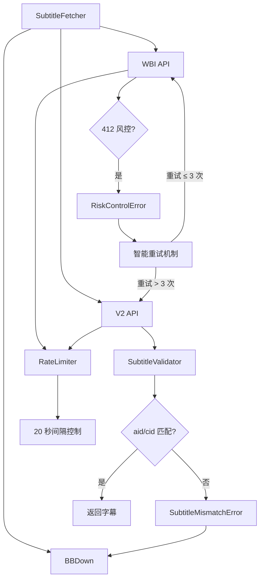
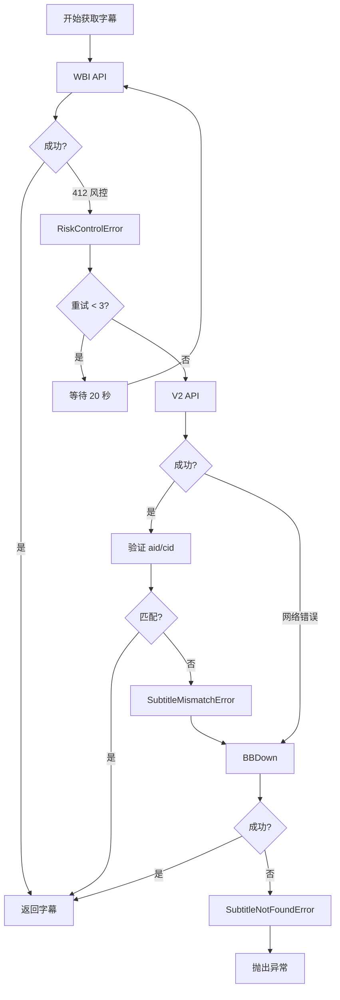
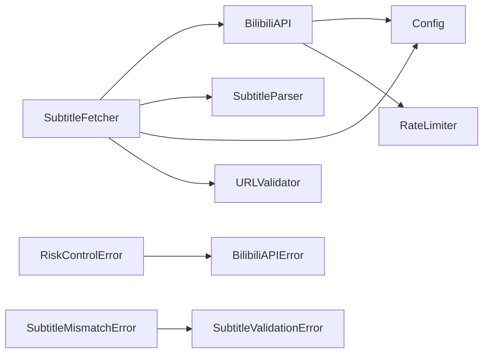

# 设计文档：B站 API 412 风控规避和字幕验证机制

## 概述

本设计文档描述了如何实现 B站 API 412 风控规避和字幕验证机制。该功能旨在解决两个核心问题：

1. **WBI API 风控问题**：`/x/player/wbi/v2` 接口有时会触发 412 风控错误，导致字幕获取失败
2. **V2 API 字幕错误问题**：降级到 `/x/player/v2` 接口时，返回的 AI 字幕可能与当前视频对不上

### 设计目标

- 实现完整的三级降级链路：WBI API → V2 API → BBDown
- 为 WBI API 412 错误实现智能重试机制（等待 + 重试）
- 为 V2 API 返回的字幕实现内容验证（aid/cid 匹配）
- 提供详细的状态追踪和日志输出
- 通过速率控制降低触发风控的概率
- 支持配置化的重试参数和请求间隔

### 关键特性

- **风控检测**：识别 HTTP 412 状态码并抛出专用异常
- **智能重试**：WBI API 失败后等待 20 秒并重试（最多 3 次）
- **字幕验证**：验证 V2 API 返回的字幕 aid/cid 是否匹配
- **降级链路**：WBI API → V2 API → BBDown 的完整降级
- **速率控制**：请求间隔从 1 秒增加到 20 秒
- **详细日志**：每个阶段都有清晰的状态日志

## 架构

### 系统架构图



### 组件关系

1. **SubtitleFetcher**：字幕获取器，协调整个降级链路
2. **BilibiliAPI**：API 客户端，负责调用 B站接口
3. **RateLimiter**：速率限制器，控制请求频率
4. **SubtitleValidator**：字幕验证器，验证字幕匹配性
5. **RetryMechanism**：重试机制，处理 412 错误的重试逻辑

### 降级链路设计

```
┌─────────────────────────────────────────────────────────────┐
│                     SubtitleFetcher                         │
│                                                             │
│  ┌──────────────────────────────────────────────────────┐  │
│  │ 1. WBI API (/x/player/wbi/v2)                        │  │
│  │    ├─ 成功 → 返回字幕                                 │  │
│  │    └─ 412 风控 → 等待 20 秒 → 重试（最多 3 次）       │  │
│  │         └─ 重试失败 → 降级到 V2 API                   │  │
│  └──────────────────────────────────────────────────────┘  │
│                          ↓                                  │
│  ┌──────────────────────────────────────────────────────┐  │
│  │ 2. V2 API (/x/player/v2)                             │  │
│  │    ├─ 成功 → 验证 aid/cid                             │  │
│  │    │    ├─ 匹配 → 返回字幕                            │  │
│  │    │    └─ 不匹配 → 降级到 BBDown                     │  │
│  │    └─ 失败 → 降级到 BBDown                            │  │
│  └──────────────────────────────────────────────────────┘  │
│                          ↓                                  │
│  ┌──────────────────────────────────────────────────────┐  │
│  │ 3. BBDown                                            │  │
│  │    ├─ 成功 → 返回字幕                                 │  │
│  │    └─ 失败 → 抛出 SubtitleNotFoundError               │  │
│  └──────────────────────────────────────────────────────┘  │
└─────────────────────────────────────────────────────────────┘
```

## 组件和接口

### 1. RiskControlError 异常类

新增的异常类，用于表示 B站 API 风控错误。

```python
class RiskControlError(BilibiliAPIError):
    """B站 API 风控错误（HTTP 412）。
    
    Attributes:
        message: 错误消息
        video_id: 视频 ID（aid 或 bvid）
        suggested_wait_time: 建议等待时间（秒）
        request_url: 触发风控的请求 URL
    """
    
    def __init__(
        self,
        message: str,
        video_id: str = "",
        suggested_wait_time: int = 20,
        request_url: str = ""
    ):
        super().__init__(message)
        self.video_id = video_id
        self.suggested_wait_time = suggested_wait_time
        self.request_url = request_url
```

### 2. SubtitleMismatchError 异常类

新增的异常类，用于表示字幕与视频不匹配。

```python
class SubtitleMismatchError(SubtitleValidationError):
    """字幕与视频不匹配错误。
    
    Attributes:
        message: 错误消息
        requested_aid: 请求的 aid
        requested_cid: 请求的 cid
        returned_aid: 返回的 aid
        returned_cid: 返回的 cid
    """
    
    def __init__(
        self,
        message: str,
        requested_aid: int = 0,
        requested_cid: int = 0,
        returned_aid: int = 0,
        returned_cid: int = 0
    ):
        super().__init__(message)
        self.requested_aid = requested_aid
        self.requested_cid = requested_cid
        self.returned_aid = returned_aid
        self.returned_cid = returned_cid
```

### 3. BilibiliAPI 修改

#### 3.1 RateLimiter 修改

修改默认请求间隔从 1 秒增加到 20 秒。

```python
class RateLimiter:
    """速率限制器。"""
    
    def __init__(self, min_interval: float = 20.0):
        """初始化速率限制器。
        
        Args:
            min_interval: 最小请求间隔（秒），默认 20 秒
        """
        self.min_interval = min_interval
        self.last_request_time = 0.0
    
    def wait_if_needed(self):
        """如果需要，等待以满足速率限制。"""
        current_time = time.time()
        time_since_last = current_time - self.last_request_time
        
        if time_since_last < self.min_interval:
            wait_time = self.min_interval - time_since_last
            time.sleep(wait_time)
        
        self.last_request_time = time.time()
```

#### 3.2 BilibiliAPI 构造函数修改

支持从配置读取请求间隔。

```python
class BilibiliAPI:
    def __init__(self, cookie: Optional[str] = None, config: Optional[Config] = None):
        """初始化 BilibiliAPI。
        
        Args:
            cookie: Cookie 字符串（可选）
            config: 配置对象（可选）
        """
        self.cookie = cookie
        self.config = config or Config()
        self.logger = logging.getLogger(__name__)
        
        # ... 其他初始化代码 ...
        
        # 速率限制器（使用配置的间隔）
        request_interval = self.config.api_request_interval
        self._rate_limiter = RateLimiter(min_interval=request_interval)
```

#### 3.3 get_player_info 修改

检测 412 状态码并抛出 RiskControlError。

```python
@retry_on_error(max_retries=3, backoff_factor=0.5)
def get_player_info(self, aid: int, cid: int) -> Dict[str, Any]:
    """获取播放器信息（包含字幕列表）。
    
    Args:
        aid: 视频 aid
        cid: 视频 cid
        
    Returns:
        播放器信息字典，包含字幕列表
        
    Raises:
        RiskControlError: 触发风控（HTTP 412）
        BilibiliAPIError: API 调用失败
        AuthenticationError: 需要登录
    """
    from ..core.exceptions import BilibiliAPIError, AuthenticationError, RiskControlError
    
    # 检查缓存
    cache_key = self._get_cache_key('player_info', aid, cid)
    cached_value = self._cache.get(cache_key)
    if cached_value is not None:
        self.logger.debug(f"Using cached player info for aid={aid}, cid={cid}")
        return cached_value
    
    # 速率限制
    self._rate_limiter.wait_if_needed()
    
    # 尝试 WBI API
    try:
        self.logger.debug(f"Trying WBI API for aid={aid}, cid={cid}")
        url = f"https://api.bilibili.com/x/player/wbi/v2?aid={aid}&cid={cid}"
        
        response = self.session.get(url, timeout=self.timeout)
        
        # 检测 412 风控
        if response.status_code == 412:
            self.logger.warning(
                f"Risk control triggered (412) for aid={aid}, cid={cid}, url={url}"
            )
            raise RiskControlError(
                message=f"Risk control triggered (HTTP 412) for aid={aid}, cid={cid}",
                video_id=f"aid={aid},cid={cid}",
                suggested_wait_time=20,
                request_url=url
            )
        
        response.raise_for_status()
        data = response.json()
        
        # 检查 API 响应码
        code = data.get('code')
        if code == -101:
            raise AuthenticationError("Login required to access player info")
        elif code == 0:
            # WBI API 成功
            player_data = data.get('data', {})
            subtitle_data = player_data.get('subtitle', {})
            subtitles = subtitle_data.get('subtitles', [])
            
            result = {
                'subtitles': subtitles,
                'subtitle_data': subtitle_data,
            }
            
            self._cache.set(cache_key, result)
            self.logger.info(f"WBI API succeeded: {len(subtitles)} subtitles found")
            return result
        else:
            error_msg = data.get('message', 'Unknown error')
            self.logger.warning(f"WBI API failed (code: {code}, message: {error_msg}), falling back to v2 API")
            
    except RiskControlError:
        # 重新抛出 RiskControlError，不要被 retry_on_error 捕获
        raise
    except Exception as e:
        self.logger.warning(f"WBI API failed: {e}, falling back to v2 API")
    
    # 降级到 V2 API
    self.logger.debug(f"Using fallback v2 API for aid={aid}, cid={cid}")
    url = f"https://api.bilibili.com/x/player/v2?aid={aid}&cid={cid}"
    
    try:
        response = self.session.get(url, timeout=self.timeout)
        response.raise_for_status()
        
        data = response.json()
        code = data.get('code')
        
        if code == -101:
            raise AuthenticationError("Login required to access player info")
        elif code != 0:
            error_msg = data.get('message', 'Unknown error')
            raise BilibiliAPIError(f"API error: {error_msg} (code: {code})")
        
        player_data = data.get('data', {})
        subtitle_data = player_data.get('subtitle', {})
        subtitles = subtitle_data.get('subtitles', [])
        
        result = {
            'subtitles': subtitles,
            'subtitle_data': subtitle_data,
        }
        
        self._cache.set(cache_key, result)
        self.logger.info(f"V2 API succeeded: {len(subtitles)} subtitles found")
        return result
        
    except requests.RequestException as e:
        raise BilibiliAPIError(f"Failed to fetch player info: {e}")
```

### 4. SubtitleFetcher 重构

#### 4.1 新增方法：_validate_subtitle

验证字幕的 aid/cid 是否匹配。

```python
def _validate_subtitle(
    self,
    subtitle_data: Dict[str, Any],
    expected_aid: int,
    expected_cid: int
) -> None:
    """验证字幕数据的 aid/cid 是否匹配。
    
    Args:
        subtitle_data: 字幕数据
        expected_aid: 期望的 aid
        expected_cid: 期望的 cid
        
    Raises:
        SubtitleMismatchError: 字幕不匹配
    """
    from ..core.exceptions import SubtitleMismatchError
    
    # 检查字幕数据是否包含 aid/cid
    if 'aid' not in subtitle_data or 'cid' not in subtitle_data:
        self.logger.warning(
            "字幕数据缺少 aid/cid 信息，无法验证匹配性"
        )
        return
    
    returned_aid = subtitle_data.get('aid')
    returned_cid = subtitle_data.get('cid')
    
    # 验证匹配性
    if returned_aid != expected_aid or returned_cid != expected_cid:
        self.logger.warning(
            f"字幕不匹配：请求 aid={expected_aid}, cid={expected_cid}，"
            f"返回 aid={returned_aid}, cid={returned_cid}"
        )
        raise SubtitleMismatchError(
            message=f"Subtitle mismatch: expected aid={expected_aid}, cid={expected_cid}, "
                   f"got aid={returned_aid}, cid={returned_cid}",
            requested_aid=expected_aid,
            requested_cid=expected_cid,
            returned_aid=returned_aid,
            returned_cid=returned_cid
        )
    
    self.logger.debug(f"字幕验证通过：aid={expected_aid}, cid={expected_cid}")
```

#### 4.2 新增方法：_retry_with_wait

实现智能重试机制（等待 + 倒计时）。

```python
def _retry_with_wait(
    self,
    func: Callable,
    max_attempts: int,
    wait_time: int,
    *args,
    **kwargs
) -> Any:
    """带等待的重试机制。
    
    Args:
        func: 要重试的函数
        max_attempts: 最大重试次数
        wait_time: 每次重试前的等待时间（秒）
        *args: 函数参数
        **kwargs: 函数关键字参数
        
    Returns:
        函数返回值
        
    Raises:
        最后一次调用的异常
    """
    from ..core.exceptions import RiskControlError
    
    last_exception = None
    
    for attempt in range(1, max_attempts + 1):
        try:
            return func(*args, **kwargs)
        except RiskControlError as e:
            last_exception = e
            
            if attempt < max_attempts:
                self.logger.warning(
                    f"WBI API 触发风控（412），等待 {wait_time} 秒后重试..."
                )
                
                # 倒计时等待
                for remaining in range(wait_time, 0, -5):
                    self.logger.info(f"等待中... 剩余 {remaining} 秒")
                    time.sleep(min(5, remaining))
                
                self.logger.info(f"正在进行第 {attempt} 次重试（WBI API）...")
            else:
                self.logger.info(f"WBI API 重试 {max_attempts} 次后仍失败")
    
    # 所有重试都失败，抛出最后一个异常
    if last_exception:
        raise last_exception
```

#### 4.3 新增方法：_fetch_from_wbi_api

从 WBI API 获取字幕（带重试）。

```python
def _fetch_from_wbi_api(
    self,
    aid: int,
    cid: int
) -> Optional[List[TextSegment]]:
    """从 WBI API 获取字幕（带重试）。
    
    Args:
        aid: 视频 aid
        cid: 视频 cid
        
    Returns:
        TextSegment 列表，失败返回 None
    """
    from ..core.exceptions import RiskControlError
    
    try:
        self.logger.info("正在使用 WBI API 获取字幕")
        
        # 使用重试机制调用 get_player_info
        max_attempts = self.config.api_retry_max_attempts
        wait_time = self.config.api_retry_wait_time
        
        player_info = self._retry_with_wait(
            self.bilibili_api.get_player_info,
            max_attempts,
            wait_time,
            aid,
            cid
        )
        
        # 处理字幕数据
        subtitles = player_info.get('subtitles', [])
        if not subtitles:
            self.logger.info("WBI API 未找到字幕")
            return None
        
        # 选择字幕并下载
        selected_subtitle = self._select_subtitle(subtitles, aid, cid)
        if not selected_subtitle:
            return None
        
        subtitle_url = selected_subtitle.get('subtitle_url')
        if not subtitle_url:
            self.logger.info("字幕 URL 为空")
            return None
        
        subtitle_data = self.bilibili_api.download_subtitle(subtitle_url)
        segments = SubtitleParser.parse_subtitle(subtitle_data)
        
        self.logger.info("WBI API 重试成功，已获取字幕")
        return segments
        
    except RiskControlError as e:
        self.logger.warning(f"WBI API 重试失败：{e}")
        return None
    except Exception as e:
        self.logger.error(f"WBI API 获取字幕失败：{e}")
        return None
```

#### 4.4 新增方法：_fetch_from_v2_api

从 V2 API 获取字幕（带验证）。

```python
def _fetch_from_v2_api(
    self,
    aid: int,
    cid: int
) -> Optional[List[TextSegment]]:
    """从 V2 API 获取字幕（带验证）。
    
    Args:
        aid: 视频 aid
        cid: 视频 cid
        
    Returns:
        TextSegment 列表，失败返回 None
    """
    from ..core.exceptions import SubtitleMismatchError
    
    try:
        self.logger.info("WBI API 失败，降级到 V2 API")
        self.logger.info("正在使用 V2 API 获取字幕")
        
        # 直接调用 V2 API（BilibiliAPI 内部已经实现了降级）
        # 这里我们需要绕过 WBI API，直接调用 V2
        # 实际上，get_player_info 已经实现了降级，所以这里可以复用
        # 但为了清晰，我们可以直接构造 V2 API 请求
        
        url = f"https://api.bilibili.com/x/player/v2?aid={aid}&cid={cid}"
        response = self.bilibili_api.session.get(url, timeout=self.bilibili_api.timeout)
        response.raise_for_status()
        
        data = response.json()
        code = data.get('code')
        
        if code != 0:
            error_msg = data.get('message', 'Unknown error')
            self.logger.warning(f"V2 API 失败：{error_msg}")
            return None
        
        player_data = data.get('data', {})
        subtitle_data = player_data.get('subtitle', {})
        subtitles = subtitle_data.get('subtitles', [])
        
        if not subtitles:
            self.logger.info("V2 API 未找到字幕")
            return None
        
        # 选择字幕并下载
        selected_subtitle = self._select_subtitle(subtitles, aid, cid)
        if not selected_subtitle:
            return None
        
        subtitle_url = selected_subtitle.get('subtitle_url')
        if not subtitle_url:
            self.logger.info("字幕 URL 为空")
            return None
        
        subtitle_data_json = self.bilibili_api.download_subtitle(subtitle_url)
        
        # 验证字幕匹配性
        self._validate_subtitle(subtitle_data_json, aid, cid)
        
        # 解析字幕
        segments = SubtitleParser.parse_subtitle(subtitle_data_json)
        
        self.logger.info("V2 API 成功获取字幕")
        return segments
        
    except SubtitleMismatchError as e:
        self.logger.warning(f"V2 API 返回的字幕与视频不匹配，降级到 BBDown")
        return None
    except Exception as e:
        self.logger.error(f"V2 API 获取字幕失败：{e}")
        return None
```

#### 4.5 新增方法：_fetch_from_bbdown

从 BBDown 获取字幕。

```python
def _fetch_from_bbdown(
    self,
    bvid: str
) -> Optional[List[TextSegment]]:
    """从 BBDown 获取字幕。
    
    Args:
        bvid: 视频 BVID
        
    Returns:
        TextSegment 列表，失败返回 None
    """
    try:
        self.logger.info("API 方式失败，使用 BBDown 获取字幕")
        
        # 使用现有的 BBDown 下载逻辑
        subtitle_files = self._download_with_bbdown(bvid)
        if not subtitle_files:
            return None
        
        # 解析字幕文件
        segments = self.parse_subtitle(subtitle_files[0])
        
        self.logger.info("BBDown 成功获取字幕")
        return segments
        
    except Exception as e:
        self.logger.error(f"BBDown 获取字幕失败：{e}")
        return None
```

#### 4.6 修改：fetch_from_bilibili_api

重构为三级降级链路。

```python
def fetch_from_bilibili_api(self, bvid: str, url: str = "") -> Optional[List[TextSegment]]:
    """使用 B站 API 获取字幕（三级降级链路）。
    
    降级链路：
    1. WBI API (/x/player/wbi/v2) + 重试机制
    2. V2 API (/x/player/v2) + 字幕验证
    3. BBDown
    
    Args:
        bvid: 视频 BVID
        url: 完整视频 URL（用于提取分P信息）
        
    Returns:
        TextSegment 列表，如果获取失败返回 None
        
    Raises:
        SubtitleNotFoundError: 所有方式都失败
    """
    if not self.bilibili_api:
        self.logger.warning("BilibiliAPI not initialized, cannot fetch from API")
        return None
    
    try:
        # 从 URL 中提取分 P 页码
        from .url_validator import URLValidator
        page = URLValidator.extract_page_number(url) if url else 1
        
        # 获取视频信息
        self.logger.info(f"Fetching video info for {bvid} (page {page})")
        video_info = self.bilibili_api.get_video_info(bvid, page)
        aid = video_info['aid']
        cid = video_info['cid']
        
        # 1. 尝试 WBI API（带重试）
        segments = self._fetch_from_wbi_api(aid, cid)
        if segments:
            return segments
        
        # 2. 尝试 V2 API（带验证）
        segments = self._fetch_from_v2_api(aid, cid)
        if segments:
            return segments
        
        # 3. 尝试 BBDown
        segments = self._fetch_from_bbdown(bvid)
        if segments:
            return segments
        
        # 所有方式都失败
        self.logger.error(
            f"所有字幕获取方式都失败：WBI API → V2 API → BBDown"
        )
        raise SubtitleNotFoundError(f"无法获取视频 {bvid} 的字幕")
        
    except SubtitleNotFoundError:
        raise
    except Exception as e:
        self.logger.error(f"获取字幕失败：{e}")
        return None
```

### 5. Config 类修改

添加新的配置项。

```python
@dataclass
class Config:
    """配置类。"""
    
    # ... 现有配置项 ...
    
    # API 请求配置
    api_request_interval: int = 20  # API 请求间隔（秒）
    api_retry_max_attempts: int = 3  # API 重试最大次数
    api_retry_wait_time: int = 20  # API 重试等待时间（秒）
```

## 数据模型

### RiskControlError

```python
@dataclass
class RiskControlError(BilibiliAPIError):
    """风控错误数据模型。"""
    message: str
    video_id: str = ""
    suggested_wait_time: int = 20
    request_url: str = ""
```

### SubtitleMismatchError

```python
@dataclass
class SubtitleMismatchError(SubtitleValidationError):
    """字幕不匹配错误数据模型。"""
    message: str
    requested_aid: int = 0
    requested_cid: int = 0
    returned_aid: int = 0
    returned_cid: int = 0
```

### 字幕数据结构

```python
# 字幕数据（从 API 返回）
{
    "aid": 123456,  # 视频 aid
    "cid": 789012,  # 视频 cid
    "body": [
        {
            "from": 1.0,
            "to": 3.0,
            "content": "字幕文本"
        }
    ]
}
```


## 正确性属性

*属性是一个特征或行为，应该在系统的所有有效执行中保持为真——本质上是关于系统应该做什么的正式陈述。属性作为人类可读规范和机器可验证正确性保证之间的桥梁。*

### 属性 1：412 风控错误识别

*对于任何* HTTP 412 响应，BilibiliAPI 应该识别为风控错误并抛出 RiskControlError 异常，该异常包含错误消息、视频 ID、建议等待时间和请求 URL。

**验证需求：1.1, 1.3, 1.4**

### 属性 2：风控错误日志记录

*对于任何* 触发 412 风控的请求，系统应该记录完整的请求信息（URL、headers、参数）、响应信息（状态码、响应体）和视频 ID，并使用 WARNING 级别。

**验证需求：1.2, 8.1, 8.2, 8.4**

### 属性 3：WBI API 智能重试机制

*对于任何* 触发 RiskControlError 的 WBI API 请求，重试机制应该：
- 等待配置的时间（默认 20 秒）后重试
- 最多重试配置的次数（默认 3 次）
- 在等待期间每 5 秒输出倒计时日志
- 重试成功时返回字幕数据并记录成功日志
- 重试失败达到上限时触发降级到 V2 API

**验证需求：2.1, 2.2, 2.3, 2.4, 2.5, 6.2, 6.3, 10.1**

### 属性 4：重试日志记录

*对于任何* 重试操作，系统应该记录每次重试的详细信息（重试次数、等待时间、失败原因）。

**验证需求：8.3**

### 属性 5：降级链路顺序

*对于任何* 字幕获取请求，SubtitleFetcher 应该按照以下顺序尝试：
1. WBI API（带重试）
2. V2 API（带验证）
3. BBDown

每个阶段失败后才进入下一个阶段。

**验证需求：6.1**

### 属性 6：字幕基本验证

*对于任何* 获取到的字幕数据，SubtitleValidator 应该验证：
- 字幕不为空
- 字幕格式正确

如果验证失败，应该抛出 SubtitleValidationError 异常并触发降级机制。

**验证需求：4.1, 4.2, 4.3, 4.4**

### 属性 7：V2 API 字幕匹配验证

*对于任何* 从 V2 API 获取的字幕数据，SubtitleValidator 应该验证字幕的 aid/cid 是否与请求的 aid/cid 匹配。如果不匹配，应该抛出 SubtitleMismatchError 异常（包含请求和返回的 aid/cid）并触发降级到 BBDown。

**验证需求：9.1, 9.3, 9.4, 9.5, 6.4, 6.5, 10.3, 10.4, 10.5**

### 属性 8：字幕验证失败日志

*对于任何* 字幕验证失败的情况，系统应该记录详细信息（请求的 aid/cid、返回的 aid/cid 或缺少的字段）。

**验证需求：9.2, 9.5**

### 属性 9：速率限制保证

*对于任何* 两次连续的 API 请求，RateLimiter 应该确保它们之间的时间间隔至少为配置的间隔（默认 20 秒）。RateLimiter 应该记录每次请求的时间戳，并在需要时等待以满足间隔要求。

**验证需求：5.1, 5.2, 5.3, 5.4, 5.5**

### 属性 10：BBDown 最终降级

*对于任何* WBI API 和 V2 API 都失败的情况，SubtitleFetcher 应该尝试使用 BBDown 获取字幕。如果 BBDown 成功，返回字幕数据；如果 BBDown 也失败，抛出 SubtitleNotFoundError 异常。

**验证需求：11.1, 11.3, 11.4, 6.6**

### 属性 11：最终失败日志

*对于任何* 所有方式都失败的情况，系统应该记录完整的降级链路日志（WBI API → V2 API → BBDown 的失败原因），并使用 ERROR 级别。

**验证需求：11.5, 8.5**

### 属性 12：配置加载和验证

*对于任何* 配置文件，系统应该：
- 正确加载 api_request_interval、api_retry_max_attempts、api_retry_wait_time
- 如果配置文件中未指定参数，使用默认值（20 秒、3 次、20 秒）
- 验证配置参数为正整数
- 如果参数无效，使用默认值并发出警告

**验证需求：7.1, 7.2, 7.3, 7.4, 7.5**

### 属性 13：V2 API 网络错误降级

*对于任何* V2 API 请求失败（网络错误、超时等），SubtitleFetcher 应该直接降级到 BBDown。

**验证需求：10.6**

## 错误处理

### 错误类型

1. **RiskControlError**：HTTP 412 风控错误
   - 触发条件：BilibiliAPI 收到 412 状态码
   - 处理方式：等待并重试（最多 3 次），然后降级到 V2 API
   - 日志级别：WARNING

2. **SubtitleMismatchError**：字幕不匹配错误
   - 触发条件：V2 API 返回的字幕 aid/cid 与请求不符
   - 处理方式：降级到 BBDown
   - 日志级别：WARNING

3. **SubtitleValidationError**：字幕验证错误
   - 触发条件：字幕为空或格式不正确
   - 处理方式：触发降级机制
   - 日志级别：WARNING

4. **SubtitleNotFoundError**：字幕不存在错误
   - 触发条件：所有方式都失败
   - 处理方式：抛出异常，终止处理
   - 日志级别：ERROR

### 错误处理流程



### 错误恢复策略

1. **WBI API 412 错误**：
   - 等待 20 秒后重试
   - 最多重试 3 次
   - 重试失败后降级到 V2 API

2. **V2 API 字幕不匹配**：
   - 记录警告日志
   - 直接降级到 BBDown

3. **V2 API 网络错误**：
   - 记录错误日志
   - 直接降级到 BBDown

4. **BBDown 失败**：
   - 记录完整的降级链路日志
   - 抛出 SubtitleNotFoundError

### 日志级别规范

- **DEBUG**：详细的调试信息（API 调用、缓存命中等）
- **INFO**：正常的状态信息（开始使用某个 API、重试倒计时等）
- **WARNING**：警告信息（风控触发、字幕不匹配、降级等）
- **ERROR**：错误信息（最终失败、无法恢复的错误等）

## 测试策略

### 双重测试方法

本功能将采用单元测试和基于属性的测试（Property-Based Testing, PBT）相结合的方法：

- **单元测试**：验证具体的示例、边缘情况和错误条件
- **属性测试**：验证跨所有输入的通用属性

两者互补，共同确保全面覆盖（单元测试捕获具体的 bug，属性测试验证通用正确性）。

### 单元测试

单元测试将专注于：

1. **具体示例**：
   - 测试特定的日志消息格式（需求 3.1-3.9）
   - 测试特定的配置值
   - 测试特定的错误场景

2. **边缘情况**：
   - 空字幕数据（需求 4.2）
   - 缺少 aid/cid 的字幕数据（需求 9.2）
   - BBDown 最终失败（需求 6.6）
   - V2 API 网络错误（需求 10.6）

3. **集成测试**：
   - 完整的降级链路测试
   - 多个组件协作测试

### 基于属性的测试

属性测试将使用 `hypothesis` 库，每个测试至少运行 100 次迭代。每个属性测试必须引用设计文档中的属性。

#### 测试库选择

- **Python**: `hypothesis` (推荐)
- 配置：每个测试最少 100 次迭代

#### 属性测试标签格式

```python
# Feature: bilibili-api-412-anti-risk-control, Property 1: 412 风控错误识别
@given(...)
def test_property_1_risk_control_error_detection(...):
    ...
```

#### 属性测试用例

1. **属性 1：412 风控错误识别**
   ```python
   # Feature: bilibili-api-412-anti-risk-control, Property 1: 412 风控错误识别
   @given(aid=st.integers(min_value=1), cid=st.integers(min_value=1))
   @settings(max_examples=100)
   def test_property_1_risk_control_error_detection(aid, cid):
       """对于任何 HTTP 412 响应，应该抛出 RiskControlError。"""
       # 模拟 412 响应
       # 验证抛出 RiskControlError
       # 验证异常包含必要字段
   ```

2. **属性 2：风控错误日志记录**
   ```python
   # Feature: bilibili-api-412-anti-risk-control, Property 2: 风控错误日志记录
   @given(aid=st.integers(min_value=1), cid=st.integers(min_value=1))
   @settings(max_examples=100)
   def test_property_2_risk_control_logging(aid, cid):
       """对于任何触发 412 的请求，应该记录完整信息。"""
       # 触发 412 错误
       # 验证日志包含 URL、headers、参数、状态码、响应体
       # 验证日志级别为 WARNING
   ```

3. **属性 3：WBI API 智能重试机制**
   ```python
   # Feature: bilibili-api-412-anti-risk-control, Property 3: WBI API 智能重试机制
   @given(
       aid=st.integers(min_value=1),
       cid=st.integers(min_value=1),
       fail_count=st.integers(min_value=1, max_value=5)
   )
   @settings(max_examples=100)
   def test_property_3_wbi_api_retry_mechanism(aid, cid, fail_count):
       """对于任何触发 RiskControlError 的请求，应该正确重试。"""
       # 模拟 WBI API 失败 fail_count 次
       # 验证重试次数不超过 3
       # 验证等待时间
       # 验证倒计时日志
       # 验证成功或降级行为
   ```

4. **属性 5：降级链路顺序**
   ```python
   # Feature: bilibili-api-412-anti-risk-control, Property 5: 降级链路顺序
   @given(
       aid=st.integers(min_value=1),
       cid=st.integers(min_value=1),
       wbi_fail=st.booleans(),
       v2_fail=st.booleans()
   )
   @settings(max_examples=100)
   def test_property_5_fallback_chain_order(aid, cid, wbi_fail, v2_fail):
       """对于任何字幕获取请求，应该按顺序尝试各个方法。"""
       # 根据 wbi_fail 和 v2_fail 模拟失败
       # 验证调用顺序：WBI API → V2 API → BBDown
       # 验证每个阶段失败后才进入下一个
   ```

5. **属性 7：V2 API 字幕匹配验证**
   ```python
   # Feature: bilibili-api-412-anti-risk-control, Property 7: V2 API 字幕匹配验证
   @given(
       requested_aid=st.integers(min_value=1),
       requested_cid=st.integers(min_value=1),
       returned_aid=st.integers(min_value=1),
       returned_cid=st.integers(min_value=1)
   )
   @settings(max_examples=100)
   def test_property_7_v2_api_subtitle_validation(
       requested_aid, requested_cid, returned_aid, returned_cid
   ):
       """对于任何 V2 API 返回的字幕，应该验证 aid/cid 匹配。"""
       # 构造字幕数据
       # 调用验证
       # 如果不匹配，验证抛出 SubtitleMismatchError
       # 如果匹配，验证通过
   ```

6. **属性 9：速率限制保证**
   ```python
   # Feature: bilibili-api-412-anti-risk-control, Property 9: 速率限制保证
   @given(
       request_count=st.integers(min_value=2, max_value=5),
       interval=st.integers(min_value=1, max_value=30)
   )
   @settings(max_examples=100)
   def test_property_9_rate_limit_guarantee(request_count, interval):
       """对于任何连续请求，应该保证最小间隔。"""
       # 创建 RateLimiter
       # 连续发送 request_count 个请求
       # 验证每两次请求之间的间隔 >= interval
   ```

7. **属性 12：配置加载和验证**
   ```python
   # Feature: bilibili-api-412-anti-risk-control, Property 12: 配置加载和验证
   @given(
       api_request_interval=st.one_of(st.none(), st.integers()),
       api_retry_max_attempts=st.one_of(st.none(), st.integers()),
       api_retry_wait_time=st.one_of(st.none(), st.integers())
   )
   @settings(max_examples=100)
   def test_property_12_config_loading_and_validation(
       api_request_interval, api_retry_max_attempts, api_retry_wait_time
   ):
       """对于任何配置值，应该正确加载和验证。"""
       # 创建配置
       # 验证加载的值
       # 如果为 None，验证使用默认值
       # 如果无效（非正整数），验证使用默认值并发出警告
   ```

### 测试覆盖目标

- 单元测试覆盖率：> 90%
- 属性测试：每个正确性属性至少一个测试
- 集成测试：覆盖完整的降级链路

### 测试工具

- **单元测试框架**：`pytest`
- **属性测试库**：`hypothesis`
- **Mock 库**：`unittest.mock` 或 `pytest-mock`
- **覆盖率工具**：`pytest-cov`

### 测试数据生成

使用 `hypothesis` 的策略生成器：

```python
import hypothesis.strategies as st

# 生成有效的 aid/cid
aids = st.integers(min_value=1, max_value=999999999)
cids = st.integers(min_value=1, max_value=999999999)

# 生成字幕数据
subtitle_data = st.fixed_dictionaries({
    'aid': aids,
    'cid': cids,
    'body': st.lists(
        st.fixed_dictionaries({
            'from': st.floats(min_value=0, max_value=3600),
            'to': st.floats(min_value=0, max_value=3600),
            'content': st.text(min_size=1)
        })
    )
})

# 生成配置值
config_intervals = st.one_of(
    st.none(),
    st.integers(min_value=-100, max_value=100)
)
```

## 实现计划

### 阶段 1：异常类和配置（优先级：高）

1. 在 `src/bilibili_extractor/core/exceptions.py` 中添加：
   - `RiskControlError` 类
   - `SubtitleValidationError` 类（如果不存在）
   - `SubtitleMismatchError` 类

2. 在 `src/bilibili_extractor/core/config.py` 中添加：
   - `api_request_interval` 配置项
   - `api_retry_max_attempts` 配置项
   - `api_retry_wait_time` 配置项

### 阶段 2：BilibiliAPI 修改（优先级：高）

1. 修改 `RateLimiter` 类：
   - 将默认间隔从 1 秒改为 20 秒
   - 支持从配置读取间隔

2. 修改 `BilibiliAPI.__init__`：
   - 接受 `config` 参数
   - 使用配置的请求间隔初始化 RateLimiter

3. 修改 `BilibiliAPI.get_player_info`：
   - 检测 HTTP 412 状态码
   - 抛出 `RiskControlError` 异常
   - 记录详细的错误日志

### 阶段 3：SubtitleFetcher 重构（优先级：高）

1. 添加 `_validate_subtitle` 方法：
   - 验证字幕 aid/cid 匹配
   - 抛出 `SubtitleMismatchError`

2. 添加 `_retry_with_wait` 方法：
   - 实现智能重试机制
   - 倒计时日志输出

3. 添加 `_fetch_from_wbi_api` 方法：
   - 调用 WBI API
   - 使用重试机制

4. 添加 `_fetch_from_v2_api` 方法：
   - 调用 V2 API
   - 验证字幕匹配性

5. 添加 `_fetch_from_bbdown` 方法：
   - 调用 BBDown

6. 重构 `fetch_from_bilibili_api` 方法：
   - 实现三级降级链路
   - 详细的状态日志

### 阶段 4：测试（优先级：中）

1. 编写单元测试：
   - 异常类测试
   - 配置加载测试
   - 日志消息测试
   - 边缘情况测试

2. 编写属性测试：
   - 为每个正确性属性编写测试
   - 使用 `hypothesis` 生成测试数据
   - 确保每个测试至少 100 次迭代

3. 编写集成测试：
   - 完整降级链路测试
   - 多组件协作测试

### 阶段 5：文档和配置示例（优先级：低）

1. 更新 `config/example_config.yaml`：
   - 添加新的配置项示例
   - 添加注释说明

2. 更新 README.md：
   - 说明新的配置项
   - 说明风控处理机制

3. 更新 CHANGELOG.md：
   - 记录新功能

## 依赖关系

### 外部依赖

- `requests`：HTTP 请求库（已有）
- `hypothesis`：属性测试库（已有）
- `pytest`：测试框架（已有）

### 内部依赖

- `Config`：配置管理
- `BilibiliAPI`：API 客户端
- `SubtitleFetcher`：字幕获取器
- `SubtitleParser`：字幕解析器
- `URLValidator`：URL 验证器

### 依赖图



## 性能考虑

### 请求间隔影响

- 将请求间隔从 1 秒增加到 20 秒会显著降低请求频率
- 对于批量处理，总时间会增加
- 权衡：降低风控风险 vs. 处理速度

### 重试机制影响

- 每次重试等待 20 秒，最多 3 次重试
- 最坏情况：60 秒的额外等待时间
- 权衡：提高成功率 vs. 响应时间

### 优化建议

1. **配置化**：允许用户根据需求调整间隔和重试次数
2. **缓存**：充分利用缓存减少 API 调用
3. **并发控制**：批量处理时考虑并发限制
4. **智能降级**：根据历史成功率动态调整策略

## 安全考虑

### Cookie 安全

- Cookie 包含敏感的认证信息
- 不应该在日志中输出完整的 Cookie
- 应该安全存储 Cookie 文件

### 日志安全

- 日志中不应该包含完整的 Cookie
- 日志中不应该包含用户的个人信息
- 错误日志应该脱敏处理

### 速率限制

- 20 秒的请求间隔有助于避免触发 B站的风控系统
- 应该遵守 B站的服务条款
- 不应该尝试绕过速率限制

## 兼容性

### 向后兼容性

- 新增的配置项有默认值，不影响现有用户
- 现有的 API 接口保持不变
- 现有的错误处理逻辑保持不变

### 配置兼容性

- 如果配置文件中没有新的配置项，使用默认值
- 如果配置项无效，使用默认值并发出警告
- 支持旧版配置文件

### Python 版本兼容性

- 支持 Python 3.8+
- 使用标准库和已有依赖
- 不引入新的外部依赖

## 监控和日志

### 日志级别

- **DEBUG**：API 调用细节、缓存命中、内部状态
- **INFO**：正常流程、重试倒计时、降级通知
- **WARNING**：风控触发、字幕不匹配、验证失败
- **ERROR**：最终失败、无法恢复的错误

### 关键日志点

1. **WBI API 调用**：
   - 开始调用：INFO
   - 412 风控：WARNING
   - 重试倒计时：INFO
   - 重试成功：INFO
   - 重试失败：WARNING

2. **V2 API 调用**：
   - 降级通知：INFO
   - 开始调用：INFO
   - 字幕验证：DEBUG
   - 验证失败：WARNING
   - 成功：INFO

3. **BBDown 调用**：
   - 降级通知：INFO
   - 开始调用：INFO
   - 成功：INFO
   - 失败：ERROR

### 监控指标

- WBI API 成功率
- WBI API 412 触发率
- V2 API 字幕不匹配率
- BBDown 使用率
- 平均重试次数
- 平均响应时间

## 未来改进

### 短期改进

1. **动态间隔调整**：根据风控触发频率动态调整请求间隔
2. **重试策略优化**：指数退避、抖动等高级重试策略
3. **缓存优化**：更智能的缓存失效策略

### 长期改进

1. **机器学习**：使用 ML 预测风控触发概率
2. **分布式限流**：支持多实例协调的速率限制
3. **健康检查**：定期检查 API 可用性
4. **降级策略配置**：允许用户自定义降级链路

## 参考资料

- [B站 API 文档](https://github.com/SocialSisterYi/bilibili-API-collect)
- [Hypothesis 文档](https://hypothesis.readthedocs.io/)
- [Python Requests 文档](https://requests.readthedocs.io/)
- [pytest 文档](https://docs.pytest.org/)
